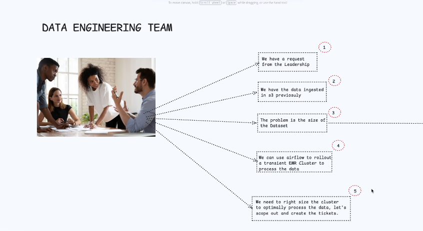
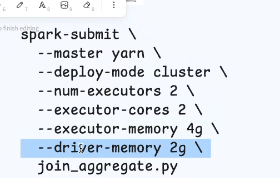
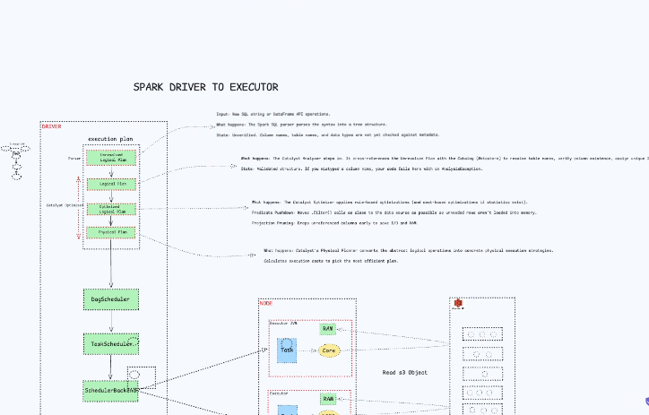
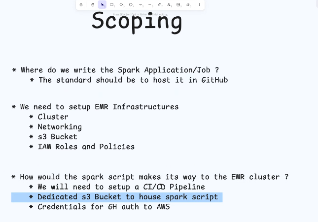
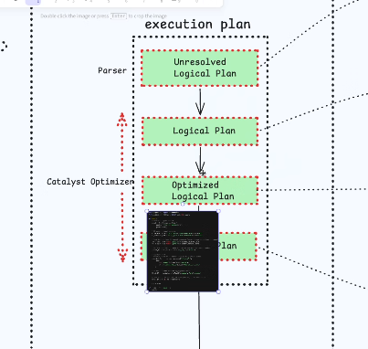

# What problem does Spark solve?

## single vs multi threaded

## cores : pandas vs polars : instruction

## nodes

## horizontal vs vertical scaling

## mapreduce: the problem with mapreduce
- does things on disk (disk i/o) whereas spark is `in-memory` processing engine

## Interaction with spark (divisions of working with Spark)
    - API
    - Spark house => Spark Architecture
    - Scripts/Jobs in data lake which is prompted to submit to spark architecture

## Spark Architecture
- Cluster Manager
- Driver
- Worker Node
- Executor
- Task

### Application submit workflow

- YARN
    - has node manager for allocating resources
    - many other components

- Driver: 
    - usually one per application submitted to the cluster
    - distributes/create the task
    - co-ordinate the executors
- Executors
- Catalyst Optimizer

    

- Dag scheduler: Dtermines the stages and task per executor (?verify)
- Task scheduler: 
- DagBackend

## Scoping

## Spark Applications
This is the collection of jobs that run within a run.

in descending order
app => job => stage => task

## Cluster Planning

- YARN launches the driver first
- However, the driver needs a specified amount of memory that must be met. For instance 2GB
- Which brings us to the fact that the remaining memory on that node some times is not enough for the executor(s)
- Hence, a better practice to allocate the same memory to all nodes while also leaving room for allowance memory for other processes.
 